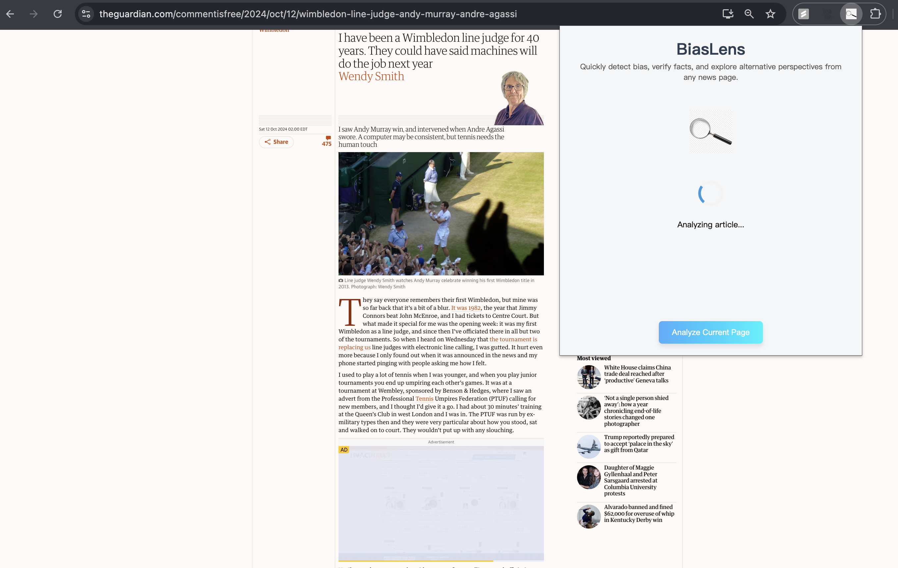

# BiasLens: A Real-Time Chrome Extension for Multi-Layer News Analysis


BiasLens is a browser extension that performs an instant, multi-layered audit of online articles—surfacing hidden framing, checking facts against live sources, and offering concise alternative viewpoints so readers.


## Architecture


## Features

- **Information Extraction**: Extract information of the article for subsequent analysis (like author, time, abstract, arguments, language style, etc)
- **Institution Analysis**: Evaluates the credibility of news sources
- **Fact Checking**: Verifies key claims in the article with references
- **Alternative Perspectives**: Provides opposing viewpoints and additional context
- **Reference Links**: Includes clickable references for all analyses

## Installation

### Prerequisites
- Python 3.8 or higher
- Chrome browser
- pip (Python package manager)

### Backend Setup
1. Clone the repository:
  ```bash
  git clone https://github.com/Eclipsemos/BiasLens.git
  cd BiasLens
  ```


2. Install required Python packages:

```bash
pip install -r requirements.txt
```


3. Configure API Keys via Environment Variables:


      1. Create a `.env` file in the `src/` directory.
    
      2. Add your credentials, including LLM API keys, model names, and search engine API keys and IDs.
            For example:


   ```bash
   # src/.env
   # All Keys here are examples. You should replace them with your own API keys
   
   LLM_API_KEY = AIsiHyQjsOlX-oapsLOycq7CNjhopiw7l-BQ1RP
   LLM_MODEL_NAME = gemini-2.0-flash-lite
   
   SEARCH_API_KEY = AIioPqPLKH-20pQ17QopkoWrLHPUI98f2po8v40
   SEARCH_ENGINE_ID = 21a51tfq2167r0qr1
   ```


4. Start the Flask backend server:

```bash
python src/app.py
```

### Chrome Extension Setup
1. Open Chrome and go to `chrome://extensions/`
2. Enable "Developer mode" in the top right
3. Click "Load unpacked" and select the `src` directory from the BiasLens project
4. The BiasLens extension icon should appear in your Chrome toolbar

## Usage

1. Navigate to any news article you want to analyze
2. Click the BiasLens icon in your Chrome toolbar
3. Click the "Analyze" button in the popup
4. Wait for the analysis to complete (this may take up to 1 minute, depends on the models you use)
5. Review the results:
   - Article Information (title, author, date, author's stance, etc)
   - Institution Analysis with credibility rating and references
   - Fact Check results with references
   - Alternative perspectives (if available) with references
   - Conclusions

## Analysis Components

[Example sources: The Guardian]( https://www.theguardian.com/commentisfree/2024/oct/12/wimbledon-line-judge-andy-murray-andre-agassi)

### Results Loading



### Article Information

- **Author**: the name of the author/commentor, if applicable. Choose the first one if there are multiple authors.
- **Date**: the time or date of the described events (use publication time if unknown)
- **Content Type**:
  - Straight News / Factual Reporting - Objective, fact-based reporting with no opinion or analysis.
  - Opinion Content - Subjective writing that includes views, arguments, or evaluations.
  - Interpretive Reporting - Factual reporting that includes context, background, or analysis to explain significance.
  - Other - Content that does not fit into the above categories.
- **Language Style**:
  - Descriptive / Neutral
  - Subjective / Emotional
  - Ironic
  - Framing / Guiding
  - Symbolic / Slogan-like
- **Abstract**: a concise abstract (1–3 sentence summary).


### Institution Analysis & Author's Positions

- **Institution**: the name of the primary news organization, website, or account responsible for the publication, if applicable.
- **Type**: types of this institution
  - Commercial
  - Government Affiliated
  - Independent
  - Citizen Journalism / KOL
  - Other
- **Credibility**: credibility of this institution, based on online searching results
  - Highly Authoritative - The institution is widely recognized as a credible source of information, with a strong reputation for accuracy and reliability.
  - Generally Reliable  - The institution is considered a reliable source, but may have some limitations or potential biases.
  - Often Questionable  - The institution has a mixed reputation, with some credible information but also instances of misinformation or bias.
  - Widely Discredited  - The institution is known for spreading misinformation or has a very poor reputation for accuracy and reliability.
  - Unverifiable - The credibility of the institution cannot be assessed due to insufficient information. Or it's not often known.
- **Reason**: the reasons for this credibility rating.
- **References**: the references in online searches.
- **Stance Overview**: the article's presetting attitude toward each entity or topic:
  - Positive
  - Negative
  - Neutral or No Presetting Tendency


### Fact Check

- **Statement**: key alleged facts, assertions, or conclusions that can be verified as true or false.
- **Verification**: fact checking results, based on online search results:
  - Verified True
  - Likely True
  - Partly True / Misleading
  - False
  - Disputed / Inconclusive
  - Unverifiable
- **Reasoning**: the reasons for this verification result.
- **References**: the references in online searches.


### Alternative Perspectives

- **Author's Opinion**: key opinions, which are subjective statements or suggestions made by the author/commentator that cannot be definitively classified as true or false.
- **Opposing Opinion Online**: alternative opinions based on online search results.
- **References**: the references in online searches.


### Conclusions

- For opinion content, the evaluation considers the following dimensions:
  - Accuracy of facts
  - Adequacy of supporting evidence
  - Logical coherence of arguments
  - Overall integrity and fairness of the information presented
- For news articles, the evaluation considers the following dimensions:
  - Factual accuracy
  - Presence of guiding or selective framing
  - Neutrality of language
  - Overall integrity and balance of the information presented

- **Overall Rating**: a quality rating based on the previous evaluation results:

  - Excellent — High-quality content with accurate facts, robust evidence, and logical coherence.
  - Good — Generally good quality with minor issues.
  - Average — Average quality with some significant issues.
  - Poor — Low quality with major issues.
  - Unverifiable — Cannot be assessed due to insufficient information

- **Conclusion**: the reasons for giving this rating.

  

## Development

### Project Structure
```bash
BiasLens/
├── README.md
├── requirements.txt          # Python dependencies
└── src
    ├── app.py                # Flask backend server
    ├── background.js         # Background script
    ├── biaslens
    │   ├── biaslens.py       # main class with different methods
    │   ├── prompt_lib.py     # LLM Prompts
    │   ├── test_result.json  # testing results example
    │   ├── test.py           # testing script
    │   └── utils.py          # search functionalities
    ├── content.js            # Content script for article extraction
    ├── images
    │   └── ...
    ├── manifest.json         # Chrome extension manifest
    ├── popup.css             # Frontend styles
    ├── popup.html            # Extension popup interface
    └── popup.js              # Frontend logic
```

### Dependencies
The project uses the following main dependencies:
- **Frontend**:
  - Chrome Extension APIs
  - HTML/CSS/JavaScript
- **Backend**:
  - Flask (Web server)
  - Flask-CORS (Cross-origin resource sharing)
  - Requests (HTTP client)
  - BeautifulSoup4 (HTML parsing)
  - Newspaper3k (Article extraction)
  - NLTK (Natural Language Processing)

### Contributing
1. Fork the repository
2. Create a feature branch
3. Commit your changes
4. Push to the branch
5. Create a Pull Request

## License

This project is licensed under the MIT License - see the LICENSE file for details.

## Acknowledgments

- Thanks to all contributors who have helped improve BiasLens
- Special thanks to the open-source community for various tools and libraries used in this project

## Team Members

- Xinyun Ye [xinyuny3]
- Qichen Wang [qichen12]
- Yucong Chen [yucong3]
- Jiayuan Hong [jh79]
